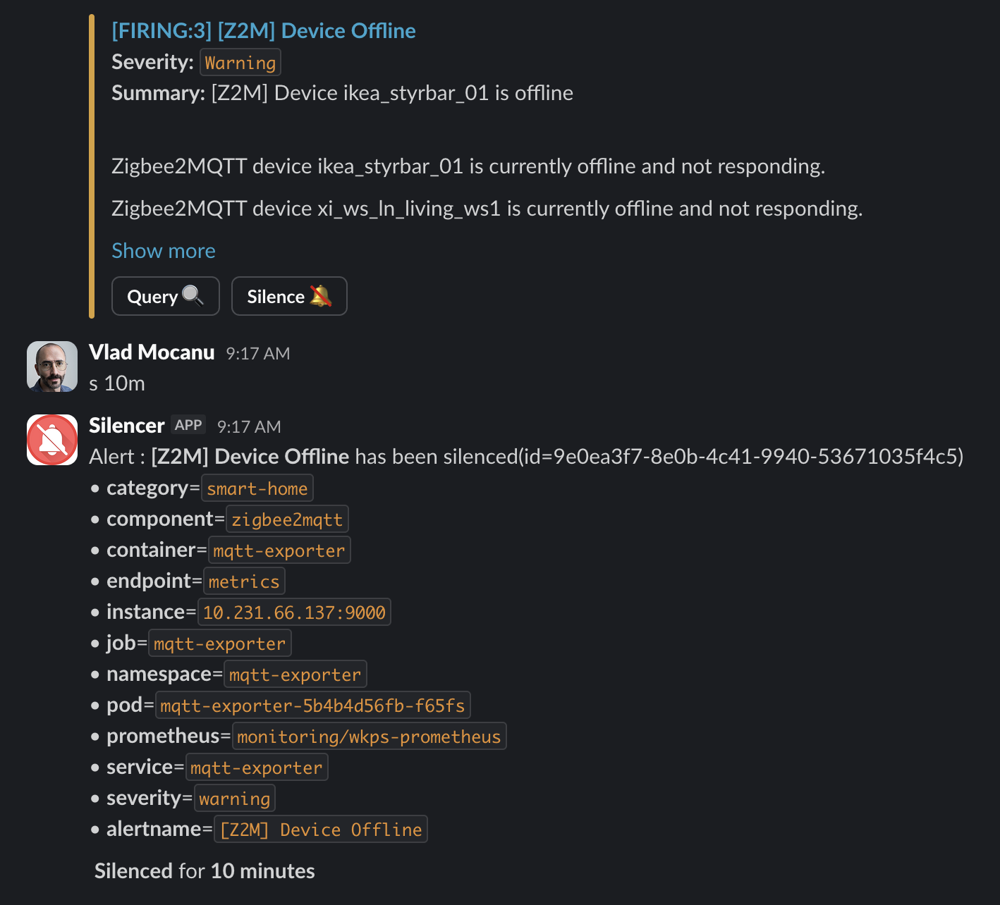

# silencer

A Slack bot that lets you silence [Prometheus Alertmanager](https://github.com/prometheus/alertmanager) alerts directly from Slack — reply `s 1h` in an alert's thread, or just type `s 1h` in the channel to silence whatever just paged.

## Overview

Silencer integrates with Alertmanager to provide convenient alert silencing capabilities from Slack:

- **Silence alerts** for specified durations (years, months, weeks, days, hours, minutes)
- **Check current silences** for an alert
- **Expire/delete silences** manually
- Auto-extracts alert labels from the Alertmanager Slack attachment
- Talks to Alertmanager's HTTP API directly — the AM URL is read from the Slack alert's silence-button, so a single bot can manage silences across multiple Alertmanager instances

## Quick Start (Docker)

```bash
docker run -d --name silencer \
  -e SLACK_APP_TOKEN=xapp-1-... \
  -e SLACK_BOT_TOKEN=xoxb-... \
  -p 3000:3000 \
  ghcr.io/vtmocanu/silencer:v2.0.3
```

Check the [GHCR package page](https://github.com/vtmocanu/silencer/pkgs/container/silencer) for the latest version. There is intentionally no `:latest` tag — pin a specific version.

Then invite the bot to your Alertmanager Slack channel and either reply `s 1h` in an alert's thread, or just type `s 1h` in the channel to silence the most recent alert.

To get the tokens, see [Slack App Configuration](#slack-app-configuration) below.

## Configuration

Silencer is configured entirely via environment variables:

| Variable          | Required | Description                                                         |
|-------------------|----------|---------------------------------------------------------------------|
| `SLACK_APP_TOKEN` | yes      | App-Level Token for Socket Mode (starts with `xapp-`)               |
| `SLACK_BOT_TOKEN` | yes      | Bot User OAuth Token (starts with `xoxb-`)                          |
| `LOG_LEVEL`       | no       | Log level (`debug`, `info`, `warn`, `error`). Defaults to `info`.   |

How you provide these is up to you — common options:

- **Docker / docker-compose**: pass with `-e` or via an env-file
- **Kubernetes**: store in a `Secret` and reference via `valueFrom.secretKeyRef`
- **Secret managers**: External Secrets Operator, sealed-secrets, Infisical, Vault, AWS Secrets Manager — any tool that ultimately surfaces values as env vars works

> **Note**: The Alertmanager URL is **not** configured via env var. Silencer extracts it from the silence-button URL on each Alertmanager Slack message.

The container exposes port `3000` for Prometheus metrics (`/metrics`) and a liveness probe (`/healthz`).

## Usage

### Setup

Invite the bot to your Alertmanager Slack channel:

```
/invite @Silencer
```

### Commands

The bot listens in any channel it has been invited to and supports two ways to issue a command:

- **Reply in an alert thread** → the bot acts on *that* alert. Use this when you want to silence a specific alert that may not be the most recent one in the channel.
- **Send a message directly in the channel (no thread)** → the bot scans the last 20 messages, finds the most recent Alertmanager alert, and acts on that. Use this when you want to silence whatever just paged you, without scrolling up to open the thread.

In both cases the bot extracts alert labels from the Alertmanager Slack attachment and creates/manages silences via Alertmanager's HTTP API.

```text
# Silence alerts
s 1h                # Silence for 1 hour
s 30m               # Silence for 30 minutes
silence for 2d      # Silence for 2 days
s 1d 2h 30m         # Silence for 1 day, 2 hours, 30 minutes
s 2w                # Silence for 2 weeks
s 1mo               # Silence for 1 month

# Check existing silences
check               # Shows active silences for this alert

# Remove silences
expire              # Delete all active silences for this alert
```

### Example Workflow

<p align="center">
  
</p>

1. Alertmanager posts an alert (in the screenshot: `[FIRING:3] [Z2M] Device Offline`)
2. You either:
   - Open the alert's thread and reply `s 10m` (acts on that specific alert), **or**
   - Just type `s 10m` in the channel directly (acts on the most recent alert in the last 20 channel messages)
3. The bot replies in-thread with the silence ID, the matchers it derived from the alert labels, and the duration
4. Later you can `check` in the same place to see remaining time, or `expire` to lift the silence early

### Important Notes

- ✅ **Two ways to invoke**: reply in an alert thread (precise), or post directly in the channel (acts on the most recent alert in the last 20 messages)
- ✅ **Automatic label extraction**: bot reads alert labels from the Alertmanager attachment's silence-button URL
- ✅ **Multiple silences**: can handle multiple active silences per alert
- ✅ **Confirmation**: always confirms actions with silence IDs
- ⚠️ **Won't work in DMs**: the bot only responds in channels it has been invited to
- ⚠️ **Channel-mode lookback is 20 messages**: if the alert you want is older than that, reply in its thread instead

## Slack App Configuration

### Prerequisites

1. Create a new Slack App at https://api.slack.com/apps
2. Use the manifest from `Silencer_manifest.json` to configure the app automatically
3. Install the app to your workspace

### Getting Required Tokens

#### Bot User OAuth Token

1. Navigate to **OAuth & Permissions** in your Slack app settings
2. Click the workspace install button to install the app to your Slack workspace
3. Copy the **Bot User OAuth Token** (starts with `xoxb-`) — this is `SLACK_BOT_TOKEN`

#### App-Level Token

1. Navigate to **Basic Information** → **App-Level Tokens**
2. Click **Generate Token and Scopes**
3. Give it a name (e.g., "Socket Mode Token")
4. Add the `connections:write` scope
5. Click **Generate** and copy the token (starts with `xapp-`) — this is `SLACK_APP_TOKEN`

### Required Permissions

The bot requires the following OAuth scopes (automatically configured via the manifest):

- `app_mentions:read` — read messages that mention the app
- `channels:history` — view messages in public channels
- `chat:write` — send messages
- `groups:history` — view messages in private channels
- `im:history` — view direct messages
- `users.profile:read` — view user profiles
- `users:read` — view user information
- `metadata.message:read` — receive message metadata
- `mpim:history` — view group direct messages

## Local Development

Build and run the container locally:

```bash
docker build -t silencer:local .
docker run --rm \
  -e SLACK_APP_TOKEN=xapp-1-... \
  -e SLACK_BOT_TOKEN=xoxb-... \
  silencer:local
```

Optional: a `devbox.json` is provided for reproducible local tooling (Node, ESLint, security scanners). If you have [devbox](https://www.jetify.com/devbox) installed:

```bash
devbox shell
```

> **Note**: npm scripts and a CI workflow are still being set up for this repository. Until then, use `docker build` and the linters/scanners from `devbox shell` directly. Contributions welcome — see [issues](https://codeberg.org/vtmocanu/silencer/issues).

## Release Process

This project uses semantic versioning with automatic releases triggered by conventional commits.

### Commit Convention

To trigger automatic releases, use conventional commit messages:

#### Patch Release (1.0.0 → 1.0.1)

```bash
fix: corrected alert parsing logic
fix(deps): update dependencies
chore(deps): update dependencies
```

#### Minor Release (1.0.0 → 1.1.0)

```bash
feat: add support for regex silences
feat(bot): implement bulk silence operations
```

#### Major Release (1.0.0 → 2.0.0)

```bash
feat!: redesigned command parsing structure
fix!: changed silence duration format

# Or with BREAKING CHANGE in the footer
feat: new alertmanager API integration

BREAKING CHANGE: removed support for legacy Slack message format
```

### Manual Release

You can also trigger a release manually via workflow dispatch with options to:

- Force a specific version bump (patch/minor/major)
- Perform a dry run
- Force a release even without conventional commits

## License

Licensed under the Apache License, Version 2.0. See [LICENSE](./LICENSE).
